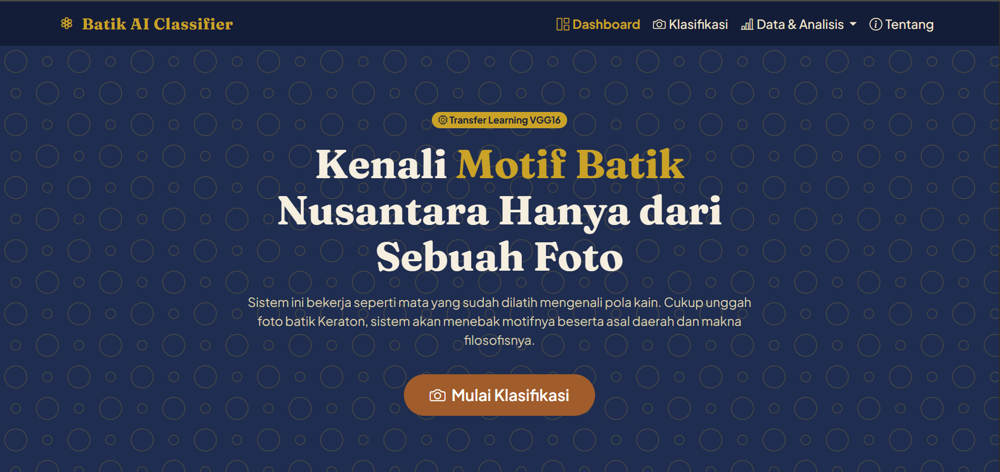
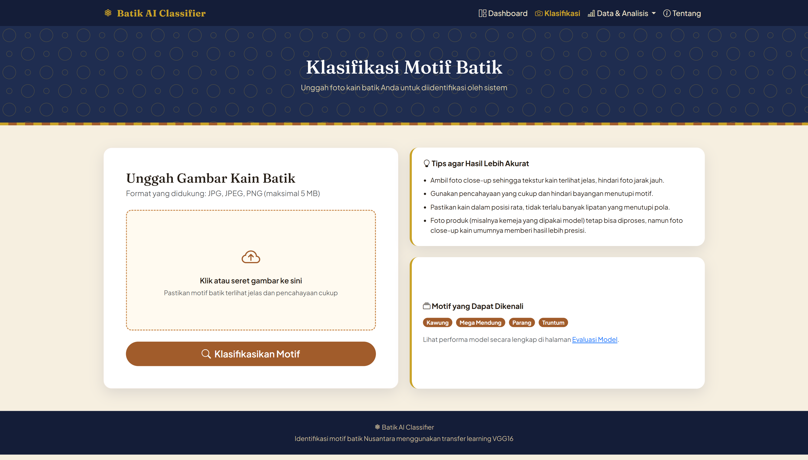
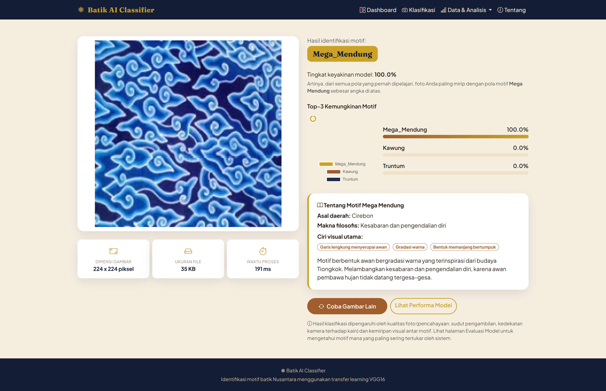
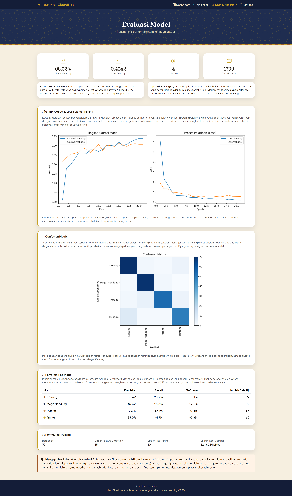
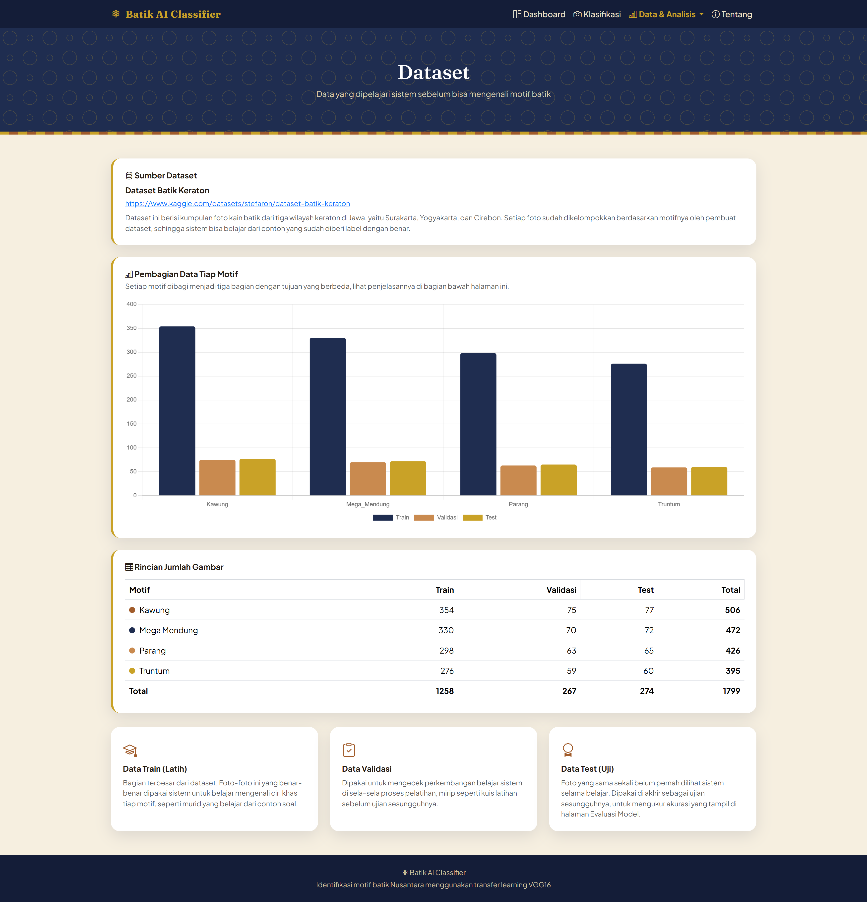
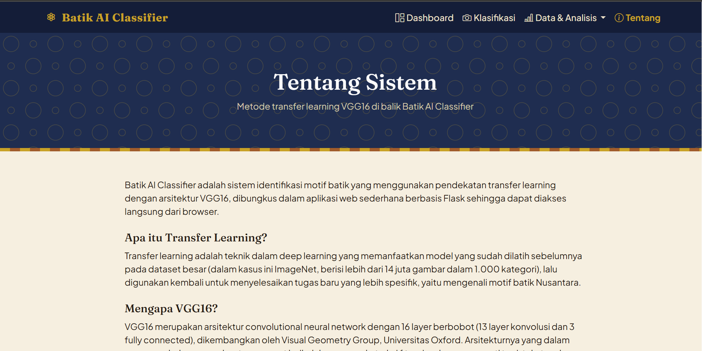

<div align="center">

# Batik AI Classifier

### Klasifikasi Motif Batik Keraton Berbasis Transfer Learning VGG16


Unggah foto kain batik, sistem akan mengenali motifnya dan menjelaskan asal daerah serta makna filosofisnya, ditenagai VGG16 hasil transfer learning.

[Fitur](#-fitur-utama) &middot; [Tangkapan Layar](#-tangkapan-layar) &middot; [Instalasi](#-instalasi--menjalankan-lokal) &middot; [Deployment](#-deployment) &middot; [Struktur Proyek](#-struktur-proyek)

</div>

<br>

<div align="center">
  
</div>

<br>

## Tentang Proyek

Batik Keraton, seperti motif Kawung, Mega Mendung, Parang, dan Truntum, punya kemiripan visual yang sering membuat orang awam kesulitan membedakannya. Batik AI Classifier dibangun untuk membantu mengenali motif-motif tersebut secara otomatis dari sebuah foto, menggunakan pendekatan **transfer learning** dengan arsitektur **VGG16** yang sudah dilatih pada jutaan gambar ImageNet, kemudian dilatih ulang secara khusus (feature extraction + fine-tuning) untuk mengenali motif batik.

Selain fitur klasifikasi, aplikasi ini transparan soal performa modelnya sendiri, lengkap dengan grafik training, confusion matrix, dan statistik dataset yang bisa dilihat langsung di halaman web, bukan cuma angka yang disembunyikan di balik layar.

## Fitur Utama

- **Klasifikasi real-time** — unggah foto lewat drag & drop, dapat hasil dalam hitungan detik
- **Top-3 prediksi** — ditampilkan dengan grafik donat dan progress bar, bukan cuma satu tebakan
- **Info edukatif tiap motif** — asal daerah, makna filosofis, dan ciri visual utama
- **Dashboard informatif** — statistik dataset, cara kerja sistem dijelaskan dengan bahasa sederhana, galeri motif, dan FAQ
- **Evaluasi model transparan** — grafik akurasi/loss, confusion matrix, performa per kelas, dan konfigurasi training, semuanya bisa dilihat publik
- **Halaman dataset** — sumber data dan distribusi jumlah gambar per kelas
- **Mode demo otomatis** — kalau model belum dilatih, aplikasi tetap jalan pakai bobot ImageNet bawaan supaya alurnya tetap bisa dicoba
- **Siap deploy** — sudah ada Dockerfile, tinggal push ke Hugging Face Spaces, Render, atau platform sejenis

## Tangkapan Layar

<table>
<tr>
<td width="50%">

**Dashboard**


</td>
<td width="50%">

**Klasifikasi**


</td>
</tr>
<tr>
<td width="50%">

**Hasil Klasifikasi**


</td>
<td width="50%">

**Evaluasi Model**


</td>
</tr>
<tr>
<td width="50%">

**Dataset**


</td>
<td width="50%">

**Tentang**


</td>
</tr>
</table>

## Motif yang Dikenali

| Motif | Asal Daerah | Ciri Visual |
|---|---|---|
| **Kawung** | Yogyakarta & Surakarta | Bulatan lonjong menyerupai buah kolang-kaling, tersusun simetris |
| **Mega Mendung** | Cirebon | Garis lengkung bergradasi menyerupai awan |
| **Parang** | Yogyakarta & Surakarta | Garis diagonal menyerupai huruf S yang berkaitan tanpa putus |
| **Truntum** | Surakarta (Solo) | Titik kecil menyerupai taburan bintang di latar gelap |

## Teknologi yang Digunakan

| Komponen | Teknologi |
|---|---|
| Backend | Flask 3.0, Gunicorn |
| Machine Learning | TensorFlow / Keras, VGG16 (transfer learning) |
| Pemrosesan Gambar | Pillow, NumPy |
| Frontend | Bootstrap 5, Bootstrap Icons, Chart.js (divendor lokal) |
| Containerization | Docker |
| Deployment | Hugging Face Spaces |

## Struktur Proyek

```
batik-vgg16-app/
├── app.py                    # Aplikasi Flask (routing, load model, inference)
├── train_model.py            # Script training transfer learning VGG16
├── split_dataset.py          # Script pembagi dataset mentah ke train/val/test
├── generate_motif_images.py  # Script pembuat ilustrasi swatch tiap motif
├── config.py                 # Konfigurasi terpusat (path, hyperparameter, dll)
├── batik_info.py             # Basis data deskripsi tiap motif batik
├── requirements.txt
├── Dockerfile
├── Procfile
├── dataset/                  # train/ val/ test/ (diisi via split_dataset.py)
├── model/                    # Output training: model .h5, metrics.json, dll
├── static/
│   ├── css/style.css
│   ├── js/main.js
│   ├── libs/chart.umd.js     # Chart.js divendor lokal
│   ├── img/                  # Favicon & ilustrasi motif
│   └── uploads/              # Penyimpanan sementara gambar yang diunggah
├── templates/                # dashboard, klasifikasi, result, evaluasi, dataset, tentang
└── docs/screenshots/         # Screenshot untuk README ini
```

## Instalasi & Menjalankan Lokal

```bash
# 1. Clone repository
git clone <url-repo-anda>
cd batik-vgg16-app

# 2. Buat virtual environment
python -m venv venv
source venv/bin/activate        # Windows: venv\Scripts\activate

# 3. Install dependensi
pip install -r requirements.txt

# 4. Jalankan aplikasi
python app.py
```

Buka **http://localhost:5000** di browser. Kalau belum ada model hasil training, aplikasi otomatis jalan dalam **mode demo** (pakai bobot ImageNet bawaan) supaya alurnya tetap bisa dicoba dari awal.

## Melatih Model dengan Dataset Sendiri

1. Download dataset motif batik (dataset yang dipakai proyek ini: [Dataset Batik Keraton](https://www.kaggle.com/datasets/stefaron/dataset-batik-keraton) di Kaggle).
2. Kalau dataset belum terbagi train/val/test, jalankan:
   ```bash
   python split_dataset.py --source "path/ke/folder/dataset/mentah"
   ```
3. Sesuaikan `batik_info.py` jika nama kelas dataset Anda berbeda.
4. Jalankan training:
   ```bash
   python train_model.py
   ```
   Model, mapping kelas, grafik training, dan confusion matrix akan otomatis tersimpan ke `model/` dan `static/evaluasi/`.
5. Jalankan ulang `python app.py`, aplikasi otomatis memakai model baru tersebut.

Lihat performa model secara lengkap dan real-time di halaman **Evaluasi Model** setelah training selesai.

## Deployment

Proyek ini sudah dilengkapi `Dockerfile` sehingga bisa dideploy ke platform mana pun yang mendukung container, misalnya **Hugging Face Spaces**:

```bash
# Login & push seperti repository git biasa ke Space Anda
git remote add space https://huggingface.co/spaces/<username>/<nama-space>
git push space main
```

> **Catatan:** file model (`model/*.h5`) biasanya berukuran besar. Gunakan Git LFS sebelum push:
> ```bash
> git lfs install
> git lfs track "*.h5"
> git add .gitattributes
> ```

Untuk platform lain dengan RAM terbatas (seperti free tier Render yang hanya 512 MB), perhatikan bahwa TensorFlow + VGG16 butuh RAM lebih besar dari itu saat inferensi. Hugging Face Spaces (free CPU Basic: 16 GB RAM) jauh lebih aman untuk aplikasi ini.

## Lisensi

Proyek ini menggunakan lisensi MIT. Model dasar VGG16 menggunakan bobot pretrained ImageNet dari Keras Applications. Dataset bersumber dari [Kaggle - Dataset Batik Keraton](https://www.kaggle.com/datasets/stefaron/dataset-batik-keraton).
